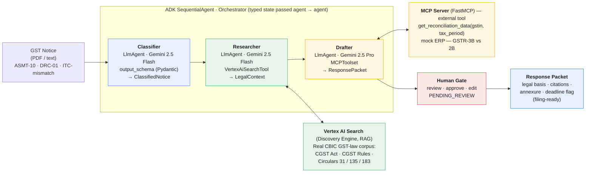

# NoticeFlow — Architecture Diagram

Presentation-quality diagram for the writeup and demo video. A standalone
[`architecture.svg`](architecture.svg) is also provided for upload/video use.

**Deployed on Vertex AI Agent Engine** · Gemini routed through Vertex AI (no AI Studio)
· compute region `us-central1` · search datastore `global`.

Engine resource: `projects/205182179995/locations/us-central1/reasoningEngines/6398074104947146752`
